# Product Intelligence Platform

Executive-grade experimentation, funnel analytics, retention intelligence, anomaly monitoring, forecasting, and AI-assisted product decision support.

---

# Overview

The Product Intelligence Platform is a full-stack analytics and experimentation system designed to simulate how modern product organizations monitor user behavior, evaluate experiments, detect anomalies, forecast engagement trends, and generate executive-facing strategic insights.

This platform combines:

- Product Analytics
- Experimentation Infrastructure
- Funnel Intelligence
- Cohort Retention Analysis
- Forecasting
- Machine Learning
- Anomaly Detection
- AI-Assisted Executive Insights
- PostgreSQL-backed Dynamic Analytics
- Synthetic Data Simulation

The project was intentionally designed to demonstrate production-oriented thinking across:

- Analytics Engineering
- Product Data Science
- ML Systems
- Backend Architecture
- Executive Dashboard Design
- AI Decision Support
- Operational Analytics Infrastructure

---

# Platform Capabilities

## Executive KPI Monitoring

Monitor platform-wide metrics including:

- Conversion Rate
- Total Events
- Experiment P-Value
- Treatment Lift
- Executive Decision Summaries

---

## Experimentation Intelligence

Built-in A/B experimentation framework with:

- Control vs Treatment comparison
- Statistical significance analysis
- Rollout recommendations
- Conversion benchmarking
- Experiment risk interpretation

---

## Funnel Intelligence

Track user movement across product stages:

- Session Start
- Product View
- Add to Cart
- Purchase

Includes:

- Funnel conversion analysis
- Funnel drop-off visualization
- Conversion efficiency tracking

---

## Growth Segment Intelligence

Analyze product performance by:

### Acquisition Channels
- Email
- Referral
- Organic
- Paid Search
- Social

### Device Segments
- Desktop
- Mobile
- Tablet

Supports:

- Segment optimization
- Growth opportunity analysis
- Conversion benchmarking

---

## Retention Intelligence

Weekly cohort retention analytics including:

- Retention heatmaps
- Behavioral persistence analysis
- Cohort decay monitoring

---

## Forecasting Engine

Predictive analytics system for:

- Daily Active Users (DAU)
- Future engagement forecasting
- Trend projection
- Behavioral movement analysis

---

## Anomaly Detection

Machine-learning powered anomaly monitoring using:

- Isolation Forest
- Outlier detection
- Product health monitoring
- Behavioral deviation tracking

---

## AI Product Analytics Copilot

LLM-assisted analytics interpretation capable of generating:

- Executive insights
- Product recommendations
- Experiment summaries
- Segment analysis
- Strategic guidance

The AI layer combines:
- Product metrics
- Experiment outputs
- Rule-based analytics
- OpenAI-powered interpretation

---

## Simulation Lab

Controlled synthetic data generation system with operational guardrails.

Users can dynamically:

- Select maximum users
- Select simulation date ranges
- Generate synthetic product-event data
- Dynamically update PostgreSQL analytics tables

Built-in guardrails include:

- Randomized record generation ranges
- Session-level execution locks
- Controlled simulation boundaries
- Safe operational limits

This module demonstrates:
- backend orchestration
- database regeneration workflows
- controlled analytics simulation
- operational safety concepts

---

# Platform Preview

---

## Executive Dashboard

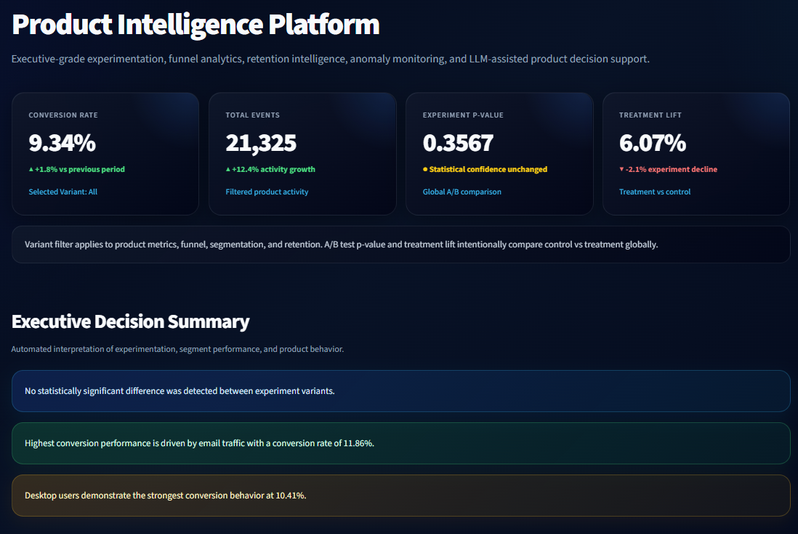

---

## Sidebar / Platform Modules

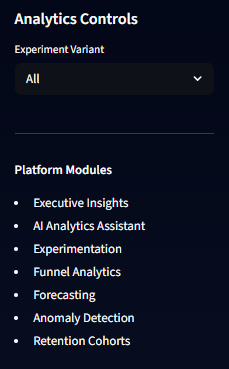

---

## Strategic Recommendations

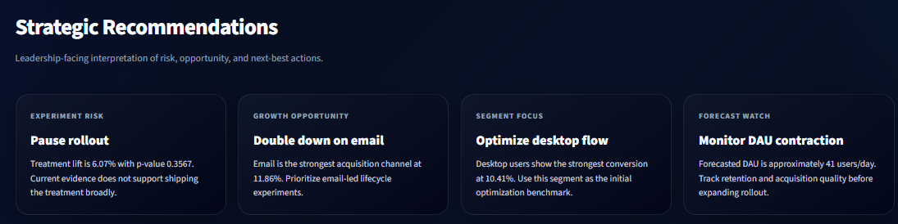

---

## Simulation Lab

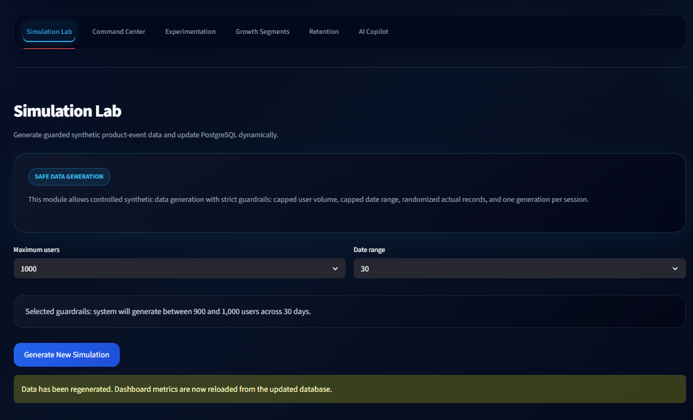

---

## Product Health Command Center

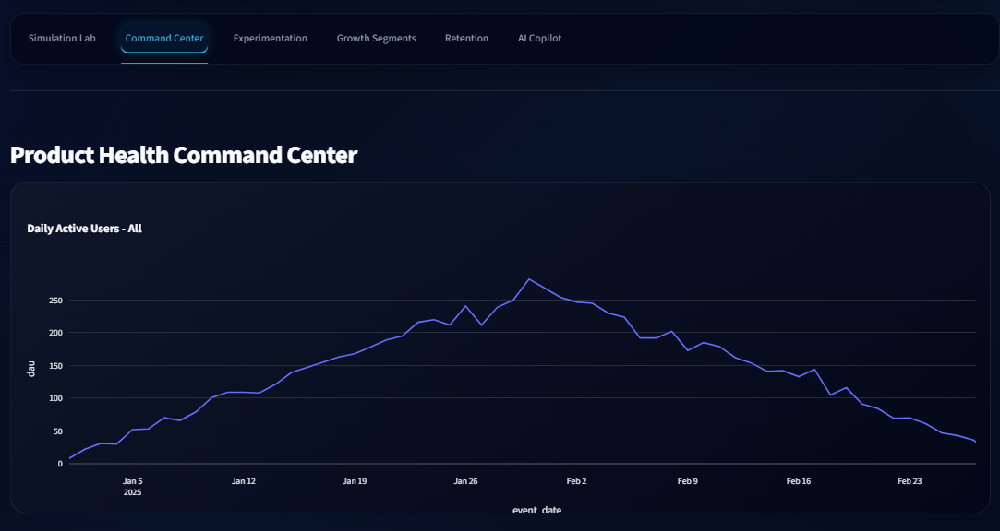

---

## DAU Forecasting & Anomaly Detection

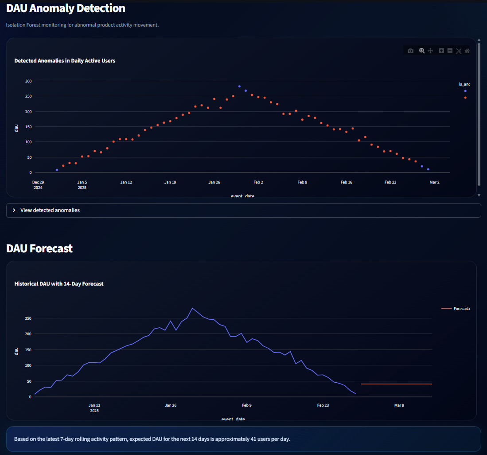

---

## Experimentation Intelligence

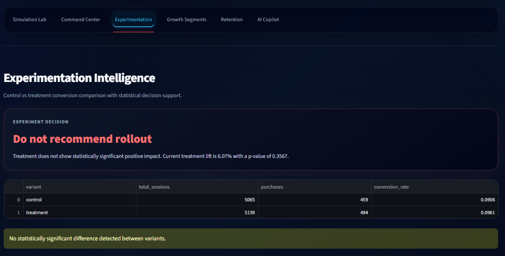

---

## Funnel Intelligence

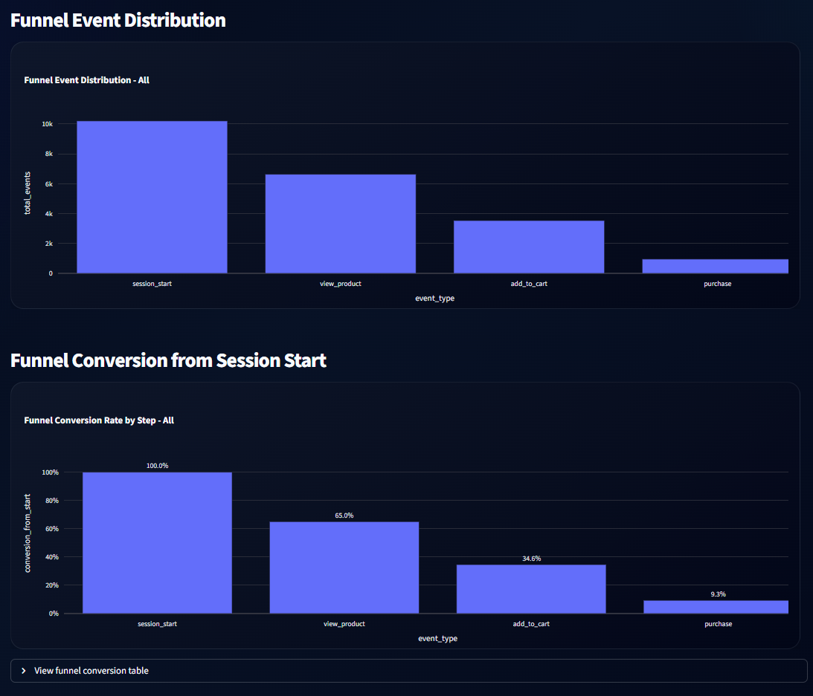

---

## Growth Segment Intelligence

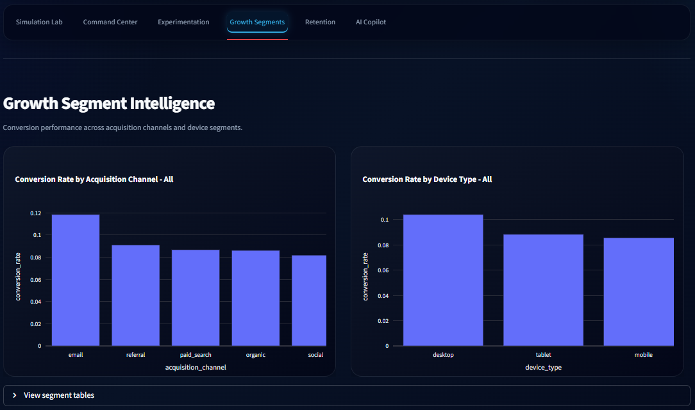

---

## Retention Intelligence

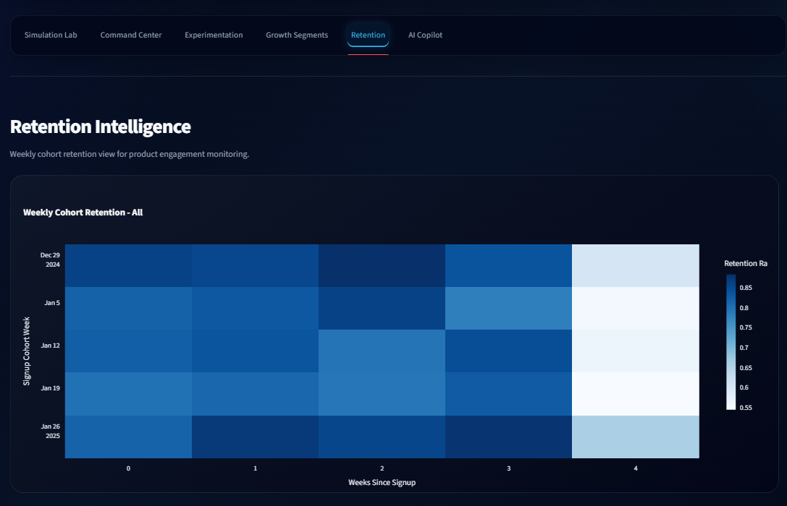

---

## AI Product Analytics Copilot

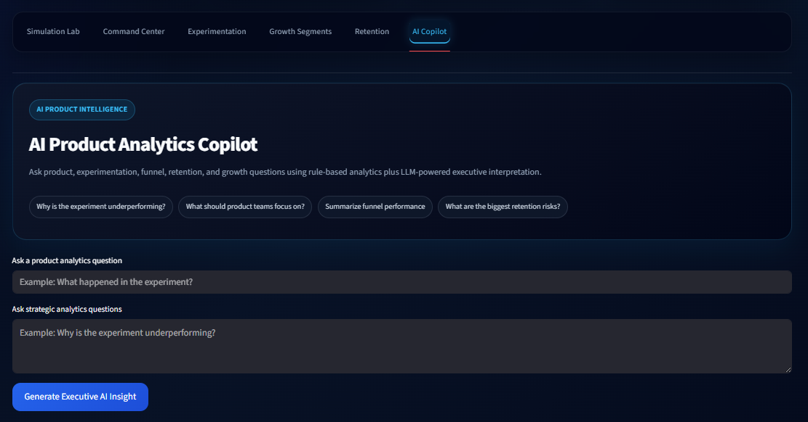

---

## Platform Architecture

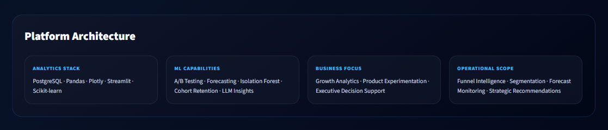

---

# System Architecture

```text
User Interface Layer (Streamlit)
                ↓
Analytics + Visualization Layer
                ↓
Experimentation + Forecasting + ML
                ↓
PostgreSQL Data Infrastructure
                ↓
AI Interpretation Layer (OpenAI)
                ↓
Executive Decision Support```

# Technology Stack

## Frontend & Visualization

- Streamlit
- Plotly

---

## Backend Infrastructure

- FastAPI
- PostgreSQL
- SQLAlchemy

---

## Data & Analytics

- Pandas
- NumPy
- StatsModels

---

## Machine Learning

- Scikit-learn
- Isolation Forest
- Forecasting Logic

---

## AI / LLM Layer

- OpenAI API
- Prompt-based executive insight generation

---

# Key Product Concepts Demonstrated

## Product Analytics

- KPI monitoring
- DAU tracking
- Funnel conversion analysis

## Experimentation Systems

- A/B testing
- Statistical validation
- Rollout analysis

## Growth Analytics

- Channel optimization
- Segment benchmarking
- Device intelligence

## Machine Learning

- Forecasting
- Anomaly detection
- Behavioral analysis

## AI Decision Support

- Executive summarization
- Product insight generation
- Strategic recommendations

## Data Infrastructure

- PostgreSQL integration
- Synthetic data pipelines
- Dynamic analytics refresh

---

# Project Structure

```text
product-experimentation-platform/
│
├── dashboard.py
├── main.py
├── requirements.txt
├── README.md
│
├── src/
│   ├── database.py
│   ├── analytics.py
│   ├── forecasting.py
│   ├── anomaly_detection.py
│   ├── retention.py
│   ├── experimentation.py
│   ├── query_assistant.py
│   └── data_generator.py
│
├── sql/
│   └── schema.sql
│
├── scripts/
│   └── seed_data.py
│
└── assets/
    └── screenshots
```

---

# Installation

## Clone Repository

```bash
git clone https://github.com/NihalShah4/product-experimentation-platform.git
```

---

## Navigate Into Project

```bash
cd product-experimentation-platform
```

---

# Create Virtual Environment

## Windows

```bash
python -m venv .venv
```

Activate environment:

```bash
.venv\Scripts\activate
```

---

# Install Dependencies

```bash
pip install -r requirements.txt
```

---

# Environment Variables

Create a `.env` file:

```env
OPENAI_API_KEY=your_openai_api_key
DATABASE_URL=your_postgresql_connection_string
```

---

# Running The Platform

## Start Streamlit Dashboard

```bash
streamlit run dashboard.py
```

---

## Optional FastAPI Backend

```bash
uvicorn main:app --reload
```

---

# Deployment

This platform is designed for deployment on:

- Streamlit Community Cloud
- Render
- Railway
- Dockerized Infrastructure

Primary deployment target:

- Streamlit Community Cloud

---

# Design Philosophy

The platform was intentionally designed to simulate how modern product organizations:

- monitor platform health
- evaluate experimentation outcomes
- identify behavioral anomalies
- track retention performance
- generate executive intelligence
- operationalize product analytics

The focus was not only analytical correctness, but also:

- executive readability
- operational realism
- scalable architecture
- visual storytelling
- decision-support thinking
- production-oriented system design

---

# Future Improvements

Potential roadmap enhancements:

- Real-time streaming pipelines
- Kafka integration
- Bayesian experimentation
- Feature flag infrastructure
- Multi-touch attribution
- Authentication & RBAC
- Docker orchestration
- Kubernetes deployment
- CI/CD automation
- Observability dashboards
- Advanced forecasting models
- Real-time anomaly alerting

---

# Author

## Nihal Shah

Data Science • Product Analytics • Experimentation Systems • AI Applications

GitHub:
https://github.com/NihalShah4

---

# License

This project is intended for educational, research, and portfolio demonstration purposes.